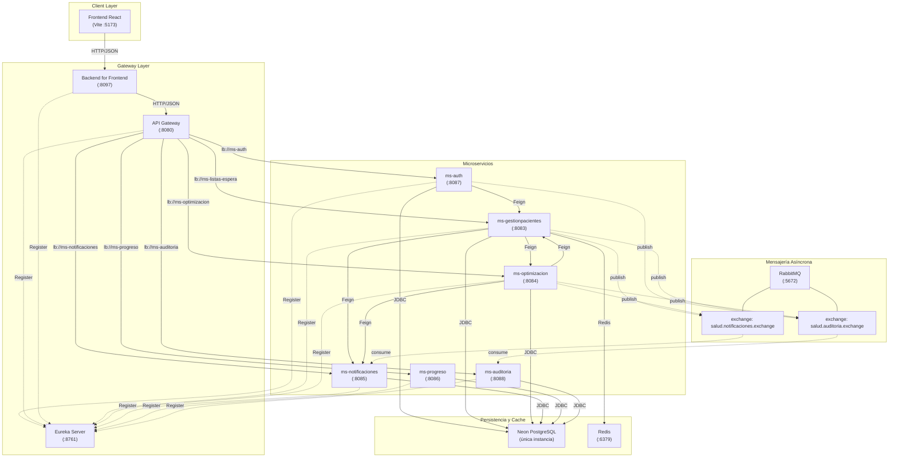

# Arquitectura — RedNorte / InsForge

## Diagrama de Arquitectura



## Puertos

| Servicio | Puerto | Propósito |
|---|---|---|
| Frontend (Vite) | 5173 | SPA React |
| BFF | 8097 | Backend for Frontend, auth proxy, agregación |
| API Gateway | 8080 | Enrutamiento, balanceo de carga |
| Eureka Server | 8761 | Service Discovery |
| ms-auth | 8087 | Autenticación JWT, registro |
| ms-gestionpacientes | 8083 | Pacientes, lista de espera |
| ms-optimizacion | 8084 | Optimización de citas (Strategy Pattern) |
| ms-notificaciones | 8085 | Notificaciones push/email |
| ms-progreso | 8086 | Progreso de pacientes |
| ms-auditoria | 8088 | Auditoría de eventos |
| RabbitMQ | 5672 / 15672 | Mensajería asíncrona |
| Redis | 6379 | Caching (usado por ms-gestionpacientes) |

## Stack Tecnológico

| Capa | Tecnología |
|---|---|
| Frontend | React 19, Vite 8, Tailwind CSS v4, Lucide React, Axios |
| Backend | Spring Boot 3.4.1, Java 17 |
| Base de datos | Neon PostgreSQL (1 instancia compartida vía Flyway) |
| Cache | Redis 7 |
| Mensajería | RabbitMQ 3 |
| Service Discovery | Eureka |
| Gateway | Spring Cloud Gateway |
| Testing Frontend | Vitest 4, Testing Library, jsdom |
| Testing Backend | JUnit 5, Mockito, JaCoCo |

## Comunicación

### Síncrona (Feign / HTTP)
```
ms-auth → ms-gestionpacientes  (validación de pacientes)
ms-gestionpacientes → ms-notificaciones  (notificar evento)
ms-gestionpacientes → ms-optimizacion  (consultar citas)
ms-optimizacion → ms-notificaciones  (notificar optimización)
ms-optimizacion → ms-gestionpacientes  (consultar lista de espera)
```

### Asíncrona (RabbitMQ)
| Exchange | Publishers | Consumer |
|---|---|---|
| `salud.auditoria.exchange` | ms-auth, ms-gestionpacientes, ms-optimizacion | ms-auditoria |
| `salud.notificaciones.exchange` | ms-gestionpacientes, ms-optimizacion | ms-notificaciones |

### Persistencia
- Todos los microservicios usan la **misma instancia Neon PostgreSQL** con tablas separadas vía Flyway
- Solo ms-gestionpacientes usa Redis para caching

## Frontend

- **Sin React Router** — navegación por estado en `App.jsx` con `activeSection`
- **httpClient.js** con baseURL `http://localhost:8097` e interceptors JWT
- **Vite proxy** configurado para desarrollo (`/api` → `localhost:8080`)
- **Tema Tailwind v4** con colores Material Design 3 en `src/index.css`
- **Componentes** en `src/componentes/`
- **Tests** junto a cada componente/API (Vitest, 248 tests, 25 archivos)
